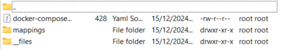

## Compose sample

[docker-compose](docker-compose.yml)

## Deploy

- If you mounting volumes to host like this, you can create own new files for mock and not go container itself, fast, but not so security variant

```
volumes:
    - ./__files:/home/wiremock/__files
    - ./mappings:/home/wiremock/mappings
```

- So if you want mount, this going to be look like this:



- If you want added test mock for example, go to mappings folder and create json file with:

```
{
    "request": {
      "url": "/api/test",
      "method": "GET"
    },
    "response": {
      "status": 200,
      "body": "{ \"test\": \"data\" }",
      "headers": {
        "Content-Type": "application/json"
      }
    }
}
```

> For more info go to [wiremock documentation](https://wiremock.org/docs/stubbing/)

- [1] In the same folder run command:

`
docker compose up -d
`

## Expected result

